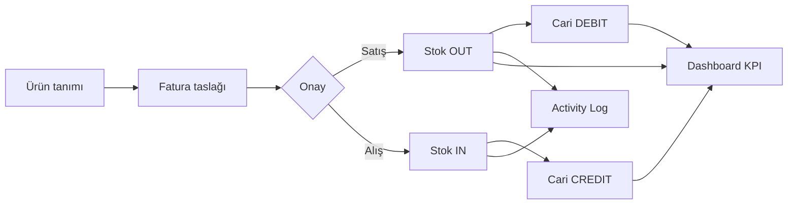

# Ventrys — Stok & Ön Muhasebe SaaS

> Küçük ve orta ölçekli işletmeler için **multi-tenant stok, fatura, cari ve barkod yönetimi** platformu.  
> Bu repo, ürünün **açık kaynak pazarlama sitesidir** — landing, SEO ve çok dilli tanıtım katmanı.

<p align="center">
  <a href="https://ventrys.site"><strong>🌐 ventrys.site</strong></a>
  &nbsp;·&nbsp;
  <a href="https://app.ventrys.site"><strong>📱 Canlı uygulama</strong></a>
  &nbsp;·&nbsp;
  <a href="https://app.ventrys.site/login?demo=1"><strong>🎯 Demo ile dene</strong></a>
</p>

---

## Bu repo ne?

Ventrys ekosisteminin **üç katmanından biri** olan pazarlama sitesinin kaynak kodudur. Ana uygulama (React SPA + Django API) ayrı, private bir repoda tutulabilir; **bu repo public kalır** ve portföyünüzde ürünü tanıtmanız için tasarlanmıştır.

| Katman                         | Teknoloji                                                              | Durum        |
| ------------------------------ | ---------------------------------------------------------------------- | ------------ |
| **Pazarlama sitesi** (bu repo) | Next.js 15, Tailwind 4, next-intl, Resend üzerinden API iletişim formu | Public       |
| **Operasyonel uygulama**       | React 19, Vite, TanStack Query, Zustand                                | Private repo |
| **REST API**                   | Django 5, DRF, PostgreSQL, JWT                                         | Private repo |

Marketing sitesi uygulama kodunu içermez; `NEXT_PUBLIC_APP_URL` ile canlı uygulamaya yönlendirir.

---

## Ürün özeti

**Ventrys**, dağınık Excel tabloları ve birbirinden kopuk araçlar yerine stok, fatura ve cariyi **tek platformda** birleştirir.

### Temel modüller

| Modül                | Ne yapar?                                                                |
| -------------------- | ------------------------------------------------------------------------ |
| **Stok**             | Kutu/adet bazlı envanter, kritik stok uyarıları, kategori yönetimi       |
| **Faturalar**        | Alış/satış, taslak → onay akışı; onayda stok + cari otomatik güncellenir |
| **Cari**             | Müşteri & tedarikçi bakiyeleri, ödeme kayıtları, hareket geçmişi         |
| **Barkod**           | Kamera/USB tarama, otomatik barkod üretimi, termal & A4 etiket yazdırma  |
| **Raporlar**         | Dashboard KPI, Chart.js trendler, Excel/PDF export                       |
| **Multi-tenant**     | Her şirket izole veri; admin/personel rolleri                            |
| **Kasa & çek/senet** | Nakit hareketleri, çek/senet portföyü, tahsil/karşılıksız durum takibi   |

### Abonelik modeli (trial + premium)

| Aşama             | Davranış                                                                                                        |
| ----------------- | --------------------------------------------------------------------------------------------------------------- |
| **Kayıt**         | E-posta doğrulama sonrası **7 günlük ücretsiz deneme** başlar                                                   |
| **Deneme süresi** | Tüm operasyonel modüllere tam erişim                                                                            |
| **Deneme bitişi** | UI kilitlenir; yalnızca Ayarlar → Geri Bildirim açık kalır                                                      |
| **Premium**       | Django Admin'de `is_premium` işaretlenir; kesintisiz kullanım                                                   |
| **İletişim**      | Uygulama içi `/auth/feedback/` (JWT) ve pazarlama sitesi `/auth/contact/` (anonim) → Resend ile `CONTACT_EMAIL` |

Pazarlama sitesinde fiyatlandırma sayfası **7 günlük ücretsiz deneme** ve **Premium** planlarını gösterir; premium CTA `/contact?category=premium_upgrade` ile iletişim formuna yönlendirir ve konu kutusunu otomatik seçer.

### Demo hesap

Canlı ortamda **kayıt olmadan** deneyebilirsiniz:

|             |                                                                        |
| ----------- | ---------------------------------------------------------------------- |
| **E-posta** | `demo@ventrys.app`                                                     |
| **Şifre**   | `Demo2026!`                                                            |
| **Kısayol** | [app.ventrys.site/login?demo=1](https://app.ventrys.site/login?demo=1) |

Demo modu: sunucudan örnek veri bir kez yüklenir, sonraki işlemler tarayıcıda simüle edilir — veritabanı kirlenmez.

---

## Uygulama nasıl çalışır?

Ventrys üç bağımsız servisten oluşur. Kullanıcı pazarlama sitesinden kayıt olur veya giriş yapar; operasyonel işlemler React SPA üzerinden yapılır; tüm kalıcı veri Django REST API üzerinden PostgreSQL'e yazılır.

### Kullanıcı akışı

```
Kayıt (e-posta doğrulama) → Şirket + admin kullanıcı oluşturulur
        │
        ▼
Giriş → JWT access token (localStorage) + refresh token (HTTP-only cookie)
        │
        ▼
Dashboard → Stok / Fatura / Cari / Barkod / Rapor modülleri
        │
        ▼
Fatura onayı → Backend tek transaction'da stok + cari + audit günceller
        │
        ▼
Frontend → TanStack Query cache invalidation → UI anında yenilenir
```

**Demo akışı farklıdır:** Giriş sonrası sunucudan seed veri bir kez çekilir, ardından tüm CRUD istekleri tarayıcıdaki localStorage sandbox'ına yönlendirilir. Backend demo şirketine yazma engellenir (403).

---

### Backend API — teknolojiler ve kullanım

| Teknoloji                  | Nerede / nasıl kullanıldı                                 |
| -------------------------- | --------------------------------------------------------- |
| **Django 5**               | Proje iskeleti, ORM, admin, migration                     |
| **Django REST Framework**  | ViewSet tabanlı CRUD, pagination, filtreleme              |
| **SimpleJWT**              | Access token (kısa ömür) + refresh token (cookie)         |
| **PostgreSQL**             | Production veritabanı; tenant izolasyonu `company_id` ile |
| **django-cors-headers**    | SPA origin'inden cross-origin istekler                    |
| **drf-spectacular**        | OpenAPI şeması → `/api/docs/` Swagger UI                  |
| **django-environ**         | `.env` ile `DATABASE_URL`, `SECRET_KEY`, JWT süreleri     |
| **openpyxl**               | Ürün/fatura/rapor Excel export                            |
| **reportlab**              | Fatura PDF üretimi                                        |
| **WhiteNoise + Gunicorn**  | Production static serve & WSGI                            |
| **pytest + pytest-django** | Domain service ve API testleri                            |

#### Multi-tenant mimari

Her kullanıcı kaydında bir **Company** (kiracı) oluşur. `TenantMiddleware` isteğe `active_company` bağlar; tüm ViewSet'ler `get_queryset()` içinde `company=self.request.user.active_company` filtresi uygular. Böylece şirketler birbirinin verisini göremez.

Roller: **Company Admin** (ayarlar, ekip, şirket bilgisi) ve **Member** (operasyonel modüller).

#### Domain modülleri (Django apps)

| App         | Modeller / sorumluluk                        | API örnekleri                                         |
| ----------- | -------------------------------------------- | ----------------------------------------------------- |
| `accounts`  | User, Company, Membership, e-posta doğrulama | `/auth/register/`, `/auth/login/`, `/company/`        |
| `inventory` | Product, Category, StockMovement             | `/products/`, `/categories/`, `/products/critical/`   |
| `parties`   | Customer, Supplier, LedgerEntry              | `/customers/`, `/suppliers/`, `/{id}/ledger/`         |
| `treasury`  | CashAccount, CheckNote, TreasuryMovement     | `/cash-accounts/`, `/checks-notes/`, durum güncelleme |
| `invoicing` | Invoice, InvoiceItem, InvoicePayment         | `/invoices/`, `/post_invoice/`, `/add_payment/`       |
| `reporting` | Aggregasyon view'ları (DB sorgusu)           | `/dashboard-summary/`, `/reports/…`                   |
| `audit`     | ActivityLog                                  | `/activity/`                                          |

#### Fatura onayı — domain service

En kritik iş kuralı `InvoiceService.post_invoice()` içindedir. Taslak fatura onaylandığında **tek `atomic` transaction** içinde:

1. **Satış faturası:** Stok yeterliliği kontrol edilir → `select_for_update` ile ürün stoku düşülür → `StockMovement (OUT)` yazılır → müşteri carisine `LedgerEntry (DEBIT)` eklenir.
2. **Alış faturası:** Stok artırılır → `StockMovement (IN)` → tedarikçi carisine `LedgerEntry (CREDIT)`.
3. **Audit log** kaydı oluşturulur.

Yetersiz stok veya eksik taraf (müşteri/tedarikçi) durumunda `ValidationError` fırlatılır; transaction rollback olur.

#### Kimlik doğrulama akışı

```
POST /auth/login/  →  { access, user }  +  Set-Cookie: refresh_token (HttpOnly)
        │
Her API isteği  →  Authorization: Bearer {access}
        │
401 alınırsa  →  POST /auth/refresh/ (cookie ile)  →  yeni access token
        │
Refresh de geçersizse  →  logout, login sayfasına yönlendir
```

Kayıt akışında e-posta doğrulama token'ı gönderilir; doğrulanmadan tam erişim kısıtlanabilir.

#### Demo koruması (backend)

`DemoReadOnlyMixin`: `company.is_demo == True` olan kiracılarda POST/PUT/PATCH/DELETE istekleri **403** döner. Demo verisi `seed_demo_account` management command ile oluşturulur; canlı ortamda kirlenmez.

---

### Frontend SPA — teknolojiler ve kullanım

| Teknoloji                      | Nerede / nasıl kullanıldı                                   |
| ------------------------------ | ----------------------------------------------------------- |
| **React 19**                   | Tüm UI; function component + hooks                          |
| **Vite 6**                     | Dev server, HMR, production bundle                          |
| **TypeScript**                 | Strict typing; API response tipleri                         |
| **React Router 7**             | `/dashboard`, `/products`, `/invoices/…` route'ları         |
| **TanStack Query v5**          | Sunucu state: `useQuery`, `useMutation`, cache invalidation |
| **Zustand**                    | Auth oturumu, tema, para birimi, fatura taslağı             |
| **Axios**                      | HTTP client; JWT interceptor + demo adapter                 |
| **react-hook-form + Zod**      | Form validasyonu (fatura, ürün, ayarlar)                    |
| **i18next + react-i18next**    | 4 dil; `localStorage` + browser detection                   |
| **Tailwind CSS 4**             | Utility-first styling; dark mode `class` stratejisi         |
| **Chart.js + react-chartjs-2** | Dashboard aylık gelir/gider grafiği                         |
| **html5-qrcode**               | Kamera ile barkod/QR tarama                                 |
| **jsbarcode + react-barcode**  | Etiket önizleme ve yazdırma                                 |
| **lucide-react**               | İkon seti                                                   |

#### Sayfa yapısı ve sorumluluklar

| Sayfa                   | Ne yapar?                                  | Kullanılan pattern                   |
| ----------------------- | ------------------------------------------ | ------------------------------------ |
| **Dashboard**           | KPI kartları, trend grafiği, son işlemler  | `useQuery(['dashboard-summary'])`    |
| **Ürünler**             | CRUD, kritik stok filtresi, barkod atama   | DataTable + modal formlar            |
| **Faturalar**           | Liste, filtre, durum badge'leri            | Pagination + search params           |
| **Fatura oluştur**      | Satır ekleme, barkod tarama, taslak kaydet | Zustand draft store + RHF            |
| **Fatura detay**        | Onay, iptal, ödeme, PDF/Excel              | Mutation + invalidation              |
| **Müşteri / Tedarikçi** | Cari kart, hareket geçmişi, fatura listesi | Nested route + ledger tab            |
| **Barkod etiketleri**   | Termal 40×30 mm ve Avery A4 layout         | Print CSS + jsbarcode                |
| **Raporlar**            | Gelir/gider, top ürünler, export           | Aggregated API + blob download       |
| **Ayarlar**             | Profil, şifre, şirket, ekip, tema          | Tab layout; demo'da yalnızca görünüm |
| **Activity**            | Denetim izi listesi                        | Paginated audit log                  |

#### State yönetimi — iki katman

**Sunucu state (TanStack Query):** Ürünler, faturalar, dashboard verisi API'den gelir. Mutation sonrası ilgili query key'ler invalidate edilir — örneğin fatura onayından sonra `['products']`, `['invoices']`, `['dashboard-summary']` aynı anda yenilenir.

**Client state (Zustand):** Oturum bilgisi, tema tercihi, para birimi sembolü ve yarım kalmış fatura taslağı tarayıcıda tutulur; sayfa yenilense bile draft korunabilir.

#### API iletişimi

```
React bileşeni
    └── useQuery / useMutation
            └── api.get('/products/')   ← Axios instance
                    ├── Request interceptor: JWT ekle, demo ise adapter devreye al
                    └── Response interceptor: 401 → token refresh → retry
                            └── Django ViewSet → Serializer → PostgreSQL
```

Pagination DRF standardında: `{ count, next, previous, results }`. Frontend `page` ve `page_size` query param'ları gönderir.

#### Demo sandbox (frontend)

Private repoda `frontend/src/demo/` altında tam bir istemci tarafı simülasyon katmanı vardır:

1. **Bootstrap:** Giriş sonrası sunucudan GET ile seed veri çekilir → `localStorage` (`ventrys-demo-state`).
2. **Router:** Axios custom adapter, demo modda istekleri `handleDemoRequest()` fonksiyonuna yönlendirir.
3. **Logic:** Fatura onayı, stok düşüşü, cari bakiye, ödeme kaydı tarayıcıda hesaplanır — backend'e POST gitmez.
4. **Export:** Excel (CSV blob) ve fatura PDF (yazdırılabilir HTML blob) mock veriden üretilir.

Bu sayede canlı demo hesabı binlerce ziyaretçi tarafından kullanılsa bile production veritabanı değişmez.

#### Barkod sistemi

- **Kamera tarama:** `html5-qrcode` ile `BarcodeScannerModal`; fatura satırı eklerken veya ürün ararken.
- **USB okuyucu:** Klavye emülasyonu yapan HID tarayıcılar `UsbBarcodeScanButton` ile dinlenir.
- **Etiket yazdırma:** `BarcodeLabelsPage` — termal rulo (40×30 mm) veya Avery L7163 A4 sheet; `@media print` CSS ile tarayıcı yazdırma.

#### i18n ve tema

- **4 dil:** Türkçe, İngilizce, Almanca, Arapça — JSON locale dosyaları, Arapça için `dir="rtl"`.
- **Tema:** Light/dark `class` stratejisi; primary renk CSS custom property ile runtime'da değiştirilir.
- **Para birimi:** Şirket ayarından sembol; dashboard ve fatura tutarları buna göre formatlanır.

---

### Modüller arası veri akışı

Ventrys'in değer önerisi modüllerin **birbirine bağlı** çalışmasıdır:



| Olay                 | Stok       | Cari                    | Rapor                 |
| -------------------- | ---------- | ----------------------- | --------------------- |
| Satış faturası onayı | Adet düşer | Müşteri borcu artar     | Gelir KPI güncellenir |
| Alış faturası onayı  | Adet artar | Tedarikçi alacağı artar | Gider KPI güncellenir |
| Ödeme kaydı          | —          | Bakiye azalır           | Tahsilat/ödeme raporu |
| Ürün silme (stoklu)  | —          | Engellenir              | —                     |

---

### Export ve raporlama

**Backend (gerçek hesaplar):**

- `openpyxl` ile `.xlsx` — ürün listesi, fatura listesi, rapor tabloları
- `reportlab` ile fatura PDF — şirket logosu, kalem tablosu, KDV dökümü

**Frontend demo:**

- Aynı endpoint path'leri Axios adapter'da yakalanır
- Gerçek `.xlsx` dosyaları `xlsx` (SheetJS) ile üretilir; fatura PDF yazdırılabilir HTML blob olarak indirilir

**Dashboard raporları:** Backend aggregation sorguları — aylık gelir/gider trendi, en çok satan ürünler, vadesi geçmiş faturalar/çek-senetler, kritik stok listesi.

---

### Geri bildirim ve iletişim altyapısı

Uygulama ve pazarlama sitesi aynı e-posta kanalını paylaşır (Resend → `CONTACT_EMAIL`):

| Kanal            | Endpoint                   | Kimlik doğrulama    | Kullanım                                               |
| ---------------- | -------------------------- | ------------------- | ------------------------------------------------------ |
| Uygulama içi     | `POST /api/auth/feedback/` | JWT (giriş gerekli) | Ayarlar → Geri Bildirim; deneme bitince tek açık ekran |
| Pazarlama sitesi | `POST /api/auth/contact/`  | Anonim (rate limit) | `/contact`, fiyatlandırma geri bildirim formu          |

Kategoriler: `bug_report`, `premium_upgrade`, `feature_request`, `general`. Premium talepleri pazarlama sitesinde `?category=premium_upgrade` query parametresi ile önceden seçilir.

---

### Geliştirme araçları ve kalite süreci

Monorepo kökünde (`ventrys/`) frontend ve backend için ortak kalite zinciri kuruludur:

| Araç                       | Rol                     | Nasıl kullanıldı                                                         |
| -------------------------- | ----------------------- | ------------------------------------------------------------------------ |
| **pnpm**                   | Paket yöneticisi        | Workspace: `frontend/`; kök script'ler `pnpm --dir frontend` ile çalışır |
| **Husky**                  | Git hook'ları           | `prepare` script ile kurulum; commit öncesi/sonrası kontroller           |
| **lint-staged**            | Staged dosya filtresi   | Yalnızca değişen dosyalarda lint/format                                  |
| **ESLint 9**               | Frontend statik analiz  | `frontend/eslint.config.js`; React hooks, refresh kuralları              |
| **Prettier**               | Kod biçimi              | TS/TSX/CSS/JSON; lint-staged ile otomatik                                |
| **TypeScript**             | Tip güvenliği           | `tsc -b --noEmit`; pre-commit'te typecheck                               |
| **Commitlint**             | Commit mesajı standardı | Conventional Commits; `type(scope): subject` zorunlu                     |
| **Commitizen + cz-git**    | İnteraktif commit       | `pnpm commit` → tür/scope/mesaj sihirbazı                                |
| **Ruff**                   | Python lint + format    | Backend'de `ruff check` ve `ruff format`                                 |
| **pytest + pytest-django** | Backend testleri        | Domain service ve API testleri; pre-commit'te `manage.py check`          |
| **drf-spectacular**        | API dokümantasyonu      | OpenAPI şeması, Swagger UI                                               |

**Pre-commit akışı** (`.husky/pre-commit`):

```
pnpm lint-staged   → ESLint --fix + Prettier (FE), Ruff (BE)
pnpm typecheck     → TypeScript derleme kontrolü
pnpm check:backend → django manage.py check
```

**Commit-msg hook:** Commitlint ile `feat(frontend): ...`, `fix(backend): ...` formatı doğrulanır.

**Kök script'ler:** `pnpm lint`, `pnpm format`, `pnpm check` (lint + typecheck + backend check + pytest).

**Pazarlama sitesi** (bu repo): Next.js ESLint (`next lint`), TypeScript strict, Vercel build pipeline.

---

### Canlıya alma mimarisi

| Bileşen       | Platform | URL                        | Notlar                                                         |
| ------------- | -------- | -------------------------- | -------------------------------------------------------------- |
| **API**       | Render   | `ventrys-api.onrender.com` | Gunicorn + WhiteNoise; Neon PostgreSQL; migrate build adımında |
| **SPA**       | Vercel   | `app.ventrys.site`         | Vite build; `VITE_API_URL`                                     |
| **Pazarlama** | Vercel   | `ventrys.site`             | Next.js SSG; `NEXT_PUBLIC_API_URL` iletişim formu              |
| **E-posta**   | Resend   | —                          | Doğrulama + geri bildirim; Render SMTP portu kullanılmaz       |
| **DB**        | Neon     | —                          | Pooled `DATABASE_URL`                                          |

**Deploy sırası:**

1. Render backend deploy → migration otomatik
2. `GET /api/health/email/` ile Resend yapılandırması doğrula
3. `CORS_ALLOWED_ORIGINS`: `app.ventrys.site` + `ventrys.site`
4. Vercel SPA deploy (`VITE_API_URL`)
5. Vercel pazarlama deploy (`NEXT_PUBLIC_APP_URL`, `NEXT_PUBLIC_API_URL`, `NEXT_PUBLIC_SITE_URL`)
6. Kayıt → 7 gün trial → geri bildirim / premium iletişim testi

`render.yaml` şablonu ve `DEPLOYMENT.md` (ana repo) ortam değişkenlerini adım adım listeler.

---

### Yapılan işler — özet

| Alan             | Gerçekleştirilen                                                               |
| ---------------- | ------------------------------------------------------------------------------ |
| **Mimari**       | Multi-tenant SaaS; marketing / SPA / API ayrımı; demo sandbox                  |
| **Backend**      | 7 Django app (treasury dahil), domain service, JWT, Resend e-posta, OpenAPI    |
| **Frontend**     | 15+ sayfa, CRUD, kasa/çek-senet, barkod, grafik, gerçek XLSX export, 4 dil RTL |
| **Abonelik**     | 7 gün trial, premium gate, geri bildirim e-posta akışı                         |
| **İş kuralları** | Fatura-stok-cari entegrasyonu, cari düzeltme, çek/senet durumları              |
| **Demo**         | Seed command + read-only backend + localStorage client simulation              |
| **Marketing**    | SEO landing, fiyatlandırma (trial/premium), iletişim formu, locale routing     |
| **Kalite**       | Husky, lint-staged, ESLint, Prettier, Ruff, pytest, Commitlint, TypeScript     |
| **Deploy**       | Render (API) + Vercel (SPA + marketing), Neon Postgres, Resend                 |

---

## Sistem diyagramı

```
┌──────────────────────────┐
│   Marketing (bu repo)    │  Next.js · SSG · 4 dil · SEO · iletişim formu
│   ventrys.site           │  POST /api/auth/contact/ → Resend
└────────────┬─────────────┘
             │  CTA → NEXT_PUBLIC_APP_URL
             ▼
┌──────────────────────────┐
│   Frontend SPA           │  React 19 · Vite · i18n · trial gate
│   app.ventrys.site       │  TanStack Query · Zustand · demo sandbox
└────────────┬─────────────┘
             │  REST + JWT (access + refresh cookie)
             ▼
┌──────────────────────────┐
│   Backend API            │  Django 5 · DRF · PostgreSQL · Resend
│  ventrys-api.onrender.com│  Multi-tenant · 7 app · domain services
└──────────────────────────┘
```

Detaylı açıklama için yukarıdaki [Uygulama nasıl çalışır?](#uygulama-nasıl-çalışır) bölümüne bakın.

---

## Bu repoda neler var?

### Tech stack

| Alan      | Kullanılan                          |
| --------- | ----------------------------------- |
| Framework | Next.js 15 (App Router)             |
| Dil       | TypeScript                          |
| Stil      | Tailwind CSS 4                      |
| i18n      | next-intl — TR / EN / DE / AR       |
| Tema      | next-themes (dark / light)          |
| Animasyon | framer-motion (scroll reveal, hero) |
| İkon      | lucide-react                        |

### SEO & performans

- `robots.txt`, dinamik `sitemap.xml`, `manifest.webmanifest`
- Sayfa bazlı metadata, hreflang, Open Graph
- JSON-LD: `Organization`, `SoftwareApplication`
- Dinamik `opengraph-image` (Edge)
- Locale middleware ile otomatik dil yönlendirme

### Dosya yapısı

```
src/
├── app/
│   ├── [locale]/           # Ana sayfa, özellikler, fiyatlandırma, iletişim
│   ├── layout.tsx
│   └── opengraph-image.tsx
├── components/
│   ├── sections/           # Hero, Features, Pricing, CTA, HowItWorks
│   ├── forms/              # ContactForm (API geri bildirim)
│   ├── layout/             # Header, Footer, LanguageSwitcher
│   ├── brand/              # Logo, LogoMark (SVG)
│   ├── seo/                # JsonLd
│   └── motion/             # Reveal, PageTransition
├── messages/               # tr.json, en.json, de.json, ar.json
├── lib/                    # seo.ts, theme.ts, images.ts
└── i18n/                   # routing, request config
public/
├── brand/                  # Logo seti (light/dark)
└── favicon/                # Favicon paketi
```

---

## Kurulum (bu repo)

```bash
git clone https://github.com/<kullanici>/ventrys-marketing.git
cd ventrys-marketing
cp .env.example .env.local
pnpm install
pnpm dev        # http://localhost:3001
```

### Ortam değişkenleri

```env
NEXT_PUBLIC_APP_URL=https://app.ventrys.site
NEXT_PUBLIC_SITE_URL=https://ventrys.site
NEXT_PUBLIC_API_URL=https://ventrys-api.onrender.com
```

| Komut        | Açıklama                        |
| ------------ | ------------------------------- |
| `pnpm dev`   | Geliştirme sunucusu (port 3001) |
| `pnpm build` | Production build                |
| `pnpm start` | Production sunucu               |
| `pnpm lint`  | ESLint                          |

### Deploy

Vercel'de root olarak bu repo deploy edilir. `NEXT_PUBLIC_*` değişkenlerini Vercel dashboard'dan tanımlayın. Backend `CORS_ALLOWED_ORIGINS` içinde pazarlama domain'i (`https://ventrys.site`) olmalıdır; aksi halde iletişim formu CORS hatası verir.

---

## Yetkinlikler (CV / portföy)

Bu proje kapsamında geliştirdiğim başlıca alanlar:

**Full-stack SaaS**

- Django REST API ile multi-tenant mimari, domain-driven invoice service
- React 19 SPA: stok, fatura, cari, barkod, raporlama modülleri
- JWT auth, e-posta doğrulama, rol tabanlı yetkilendirme

**Frontend mühendisliği**

- TanStack Query + Zustand ile state yönetimi
- 4 dil i18n, RTL, dark/light tema sistemi
- Barkod tarama (kamera/USB), Chart.js dashboard, PDF/Excel export
- localStorage tabanlı demo sandbox (Axios adapter pattern)

**Pazarlama & SEO**

- Next.js 15 App Router, next-intl locale routing
- Structured data, OG image, sitemap, hreflang
- Framer Motion ile performanslı landing animasyonları

**DevOps & kalite**

- Render + Vercel + Neon Postgres üç katmanlı production mimarisi
- Resend ile transactional e-posta (doğrulama, geri bildirim, iletişim)
- Husky pre-commit: lint-staged, TypeScript, `manage.py check`
- Commitlint conventional commits; Commitizen ile standart mesajlar
- pytest, Ruff, ESLint, Prettier; `pnpm check` tek komutla tam doğrulama

---

## Lisans & iletişim

Bu repo (pazarlama sitesi) public olarak paylaşılabilir. Ana uygulama kodu private repoda tutulmaktadır.

**Geliştirici:** [M.Yalçın Haratoğlu](https://www.linkedin.com/in/myalcinharatoglu/) · [GitHub](https://github.com/yalcinHaratoglu)

---

<p align="center">
  <sub>Ventrys — Stok ve ön muhasebe, tek platformda.</sub>
</p>
